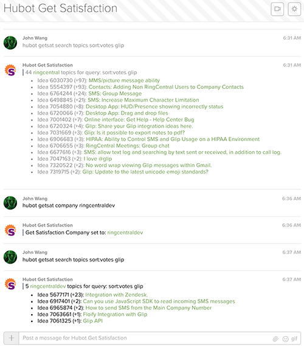

# hubot-getsatisfaction


Hubot Get Satisfaction handler script to query topics by company.

[![NPM Version][npm-image]][npm-url]
[![NPM Downloads][downloads-image]][downloads-url]
[![License][license-svg]][license-link]

[![Stories in Ready][story-status-svg]][story-status-link]

See [`src/getsatisfaction.coffee`](src/getsatisfaction.coffee) for full documentation.

## Installation

In hubot project repo, run:

`npm install hubot-getsatisfaction --save`

Then add **hubot-getsatisfaction** to your `external-scripts.json`:

```json
["hubot-getsatisfaction"]
```

## Configuration
```
HUBOT_GETSATISFACTION_COMPANY=API Company Name URL Slug
```

## Usage
```
hubot getsat search (topics) <QUERY> - returns a list of matching topics.
hubot getsat (all) ideas - returns the total count of all ideas.
hubot getsat company - returns the total count of all ideas.
hubot getsat company <COMPANY_NAME> - sets company_name.
```

### Search Topics

To search topics you can use the following topic filters which must be placed ahead of your query. For example `hubot getsat search topics sort:votes style:idea glip`.

| Filter | Values | Notes |
|--------|--------|-------|
| `sort` | `votes, newest, active, replies, unanswered` | `votes` is an alias for `most_me_toos` |
| `style` | `question, problem, praise, idea, update` | |
| `status` | `none, pending, active, complete, rejected, open, closed` | `open` and `closed` are meta values. `open` = `none or pending or active`, `closed` = `complete or rejected` |

More information on filters is available here: [https://education.getsatisfaction.com/reference-guide/api/api-resources/](https://education.getsatisfaction.com/reference-guide/api/api-resources/).

### Example Usage

Create a Hubot instance, add `hubot-getsatisfaction` to `external-scripts.json` and start.

The following example uses the [`hubot-glip` adapter](https://github.com/tylerlong/hubot-glip).

```bash
$ mkdir myhubot
$ cd myhubot
$ yo hubot
$ vi external-scripts.json
$ HUBOT_GLIP_HOST=glip.com \
HUBOT_GLIP_EMAIL=hubot@example.com \
HUBOT_GLIP_PASSWORD=MySecretPassword \
HUBOT_GETSATISFACTION_COMPANY=ringcentral ./bin/hubot -n hubot -a glip
```



## Links

Project Repo

* https://github.com/grokify/hubot-getsatisfaction

Hubot

* https://github.com/github/hubot

Get Satisfaction API

* API Reference: https://education.getsatisfaction.com/reference-guide/api/
* API Specs: https://github.com/grokify/api-specs/tree/master/specs/getsatisfaction

## Contributing

1. Fork it ( http://github.com/grokify/hubot-getsatisfaction/fork )
2. Create your feature branch (`git checkout -b my-new-feature`)
3. Commit your changes (`git commit -am 'Add some feature'`)
4. Push to the branch (`git push origin my-new-feature`)
5. Create new Pull Request

## License

Hubot Get Satisfaction script is available under the MIT license. See [LICENSE.md](LICENSE.md) for details.

Hubot Get Satisfaction script &copy; 2016 by John Wang

 [npm-image]: https://img.shields.io/npm/v/hubot-getsatisfaction.svg
 [npm-url]: https://npmjs.org/package/hubot-getsatisfaction
 [downloads-image]: https://img.shields.io/npm/dm/hubot-getsatisfaction.svg
 [downloads-url]: https://npmjs.org/package/hubot-getsatisfaction
 [story-status-svg]: https://badge.waffle.io/grokify/hubot-getsatisfaction.svg?label=ready&title=Ready
 [story-status-link]: https://waffle.io/grokify/hubot-getsatisfaction
 [license-svg]: https://img.shields.io/badge/license-MIT-blue.svg
 [license-link]: https://github.com/grokify/hubot-getsatisfaction/blob/master/LICENSE.md
